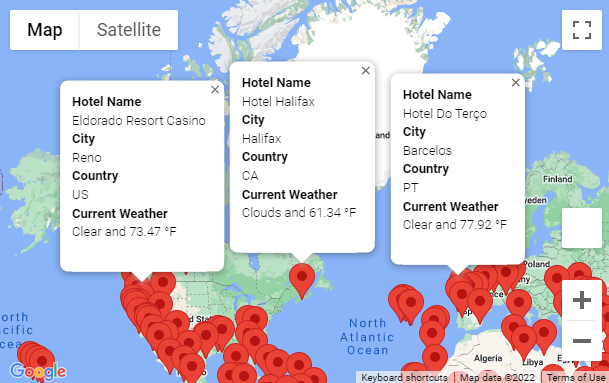
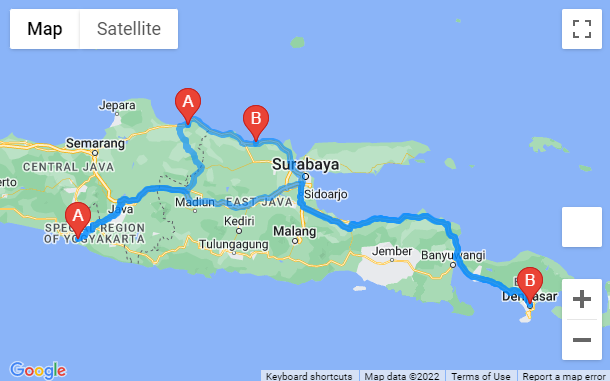
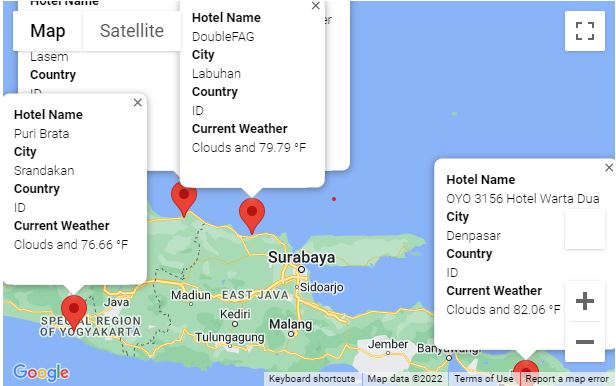

# World_Weather_Analysis

## Overview

### Purpose
Retrieve Weather Data, Create a Customer Travel Destinations Map, and Create a Travel Itinerary Map.

### Background
Jack loves the PlanMyTrip app. Beta testers love it too. And, as with any new product, they've recommended a few changes to take the app to the next level. Specifically, they recommend adding the weather description to the weather data.

For this challenge, you will use the weather description data you've already retrieved in this module to enhance the PlanMyTrip app. Then, you'll have the beta testers use input statements to filter the data for their weather preferences, which will be used to identify potential travel destinations and nearby hotels. The beta tester will choose four cities from the list of potential travel destinations to create a travel itinerary. Finally, using the Geoapify Routing API, you will create a travel route between the four cities and a marker layer map.

## Results

First, The weather data was retrieved using numpy, pandas, and citipy. This can be viewed through the below link.

[Weather_Database/Weather_Database.ipynb](Weather_Database/Weather_Database.ipynb)

Next, a travel destinations map was created. This is shown in the resources provided below.

[Vacation_Search/Vacation_Search.ipynb](Vacation_Search/Vacation_Search.ipynb)

Lastly, a travel itinerary map was created. This is shown in the following resources.

[Vacation_Itinerary/Vacation_Itinerary.ipynb](Vacation_Itinerary/Vacation_Itinerary.ipynb)

